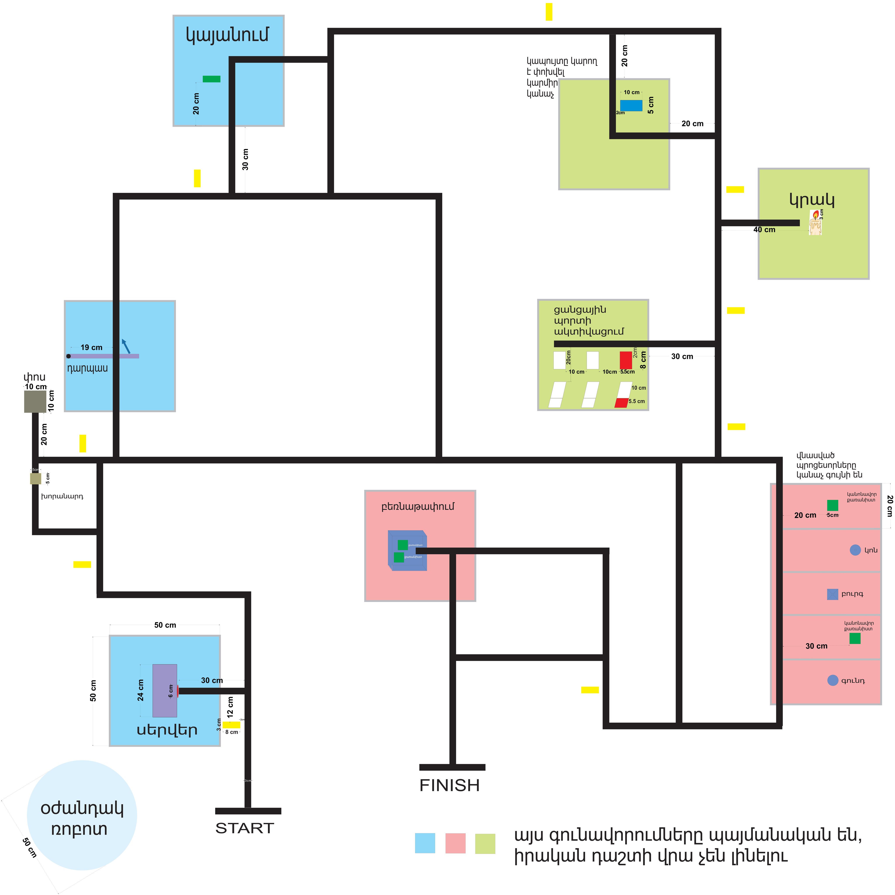

# Robot-for-fixing-Ai-factory-s-problems

# Smart Car 2WD — Autonomous Robot Challenge

I am building an autonomous robot using a **Smart Car 2WD chassis**. The robot is designed to complete a series of challenges on a **4×8 meter field** that simulates a small server room.

The field contains **8 different tasks**, divided into **3 easy, 3 medium, and 2 difficult challenges**. The robot must complete the tasks autonomously while navigating through the field.

## Competition Field

*This is the competition field for ArmRobotics2026.*

## Navigation

Throughout the entire course, the robot must continuously **follow a black line**.

Before each task, there is also a **yellow line on the left side of the black line**. This yellow line is used as an additional navigation and positioning reference, helping the robot identify the area where the next task begins.

## Tasks

### 1. Press the Server Button

At the beginning of the course, the robot must identify the **Server button** and press it to activate the first part of the challenge.

### 2. Open the Door

The robot must find a **wooden cube** and push or drop it into a designated hole. This action triggers the mechanism that **opens the door**.

### 3. Simulate Charging

After passing through the opened door, the robot must move into a **marked square** and remain inside it for at least **5 seconds**. This represents the robot connecting to a charging station and recharging before continuing.

### 4. Detect and Display a Light Color

The robot must detect the **color of a light positioned in front of it**. After identifying the color, it must display the same color using its own LEDs or another visual indicator for at least **5 seconds**.

### 5. Extinguish the Candle

The robot must move toward a **candle** and extinguish the flame. It must complete this task **without touching the candle and without using airflow**.

### 6. Identify and Connect the Correct Port

The robot must determine **which port has its indicator light turned on**. After identifying the correct port, it must move to it and **connect or activate that port**.

### 7. Pick Up the Damaged CPUs

The robot must locate **two damaged CPUs** placed on the field. It must approach them, pick them up using its mechanism, and transport them without dropping them.

### 8. Place the CPUs in the Container

After collecting the two damaged CPUs, the robot must transport them to the designated area and **place both CPUs inside a special container**. This completes the final challenge.

## Main Goal

The main goal of the project is to create a robot capable of **autonomously navigating the field, recognizing objects and colors, interacting with different mechanisms, and completing all 8 tasks accurately** while continuously following the required path.

